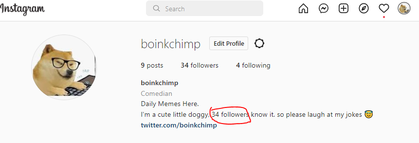

# Instagram-bio-followers-display
## Display your Instagram Followers on Bio

**Did you ever wonder how TomScott did this**


**ignore it let's do it for Instagram** 



### [ Example Instagram Account ](https://www.instagram.com/boinkchimp/)

## Installation

1. Download the repository

    ```bash
    git clone https://github.com/Pasanlaksitha/Instagram-bio-followers-display.git
    ```

2. requirement.txt install  
    ```bash
    pip install -r requirements.txt
    ```

3. open bio.py and enter username password 
    ```python
    username = "USERNAME"
    password = "PASSWORD"
    ```
4. schedule for the run program (recommended: once per 6 hours ) 
    - schedule it on task scheduler or google cloud 

## Other Usage

you can convert this for following and posts count also 

- for following count 
    ```python
    #change scraping json to this
    followers = data2['graphql']['user']['edge_follow']['count']
    ```
- read JSON on Instagram https://www.instagram.com/boinkchimp/?__a=1 to do more

## Note 

i used this on Gcloud VM but not working json scrap part on it cuz instagram blocking scraping scripts you can block there script load or use api on rapid API

## Contributing
Pull requests are welcome. For major changes, please open an issue first to discuss what you would like to change.


## License
[MIT](https://github.com/Pasanlaksitha/Instagram-bio-followers-display/blob/main/LICENSE/)
